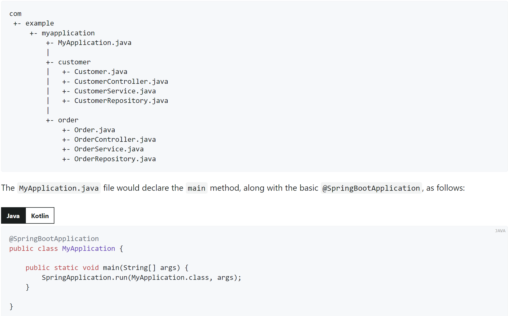
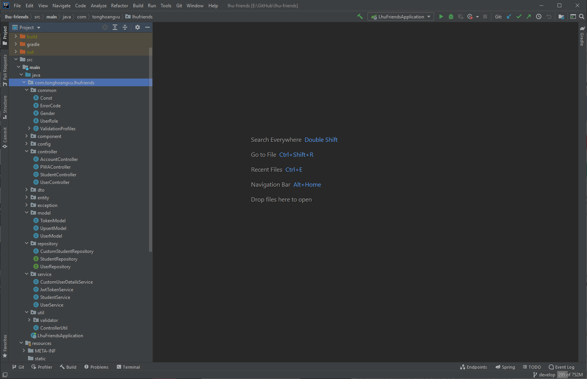

# Nhật kí học tự học Spring boot.
_Trước khi học mình đã cũng có ôn lại những kiến thức cơ bản nhất của Java (Chủ yếu thông qua việc đọc document)_

_Lưu ý: Những chữ in nghiên sẽ mang thiên hướng chủ quan, cá nhân như một cách để mình học và tự củng cố kiến thức.
Còn lại, nó đến từ việc luyện tập và thu thập dữ liệu của mình rồi trình bày nó dưới dạng text hoặc coding thông qua cái bài viết.
Mình làm những điều trên để sau này mình có thể ôn lại._

_Khi có một thông tin gì đó mới, mình sẽ áp dụng cấu trúc: What? Why? How? Cho 1 vấn đề_

_Bài viết dưới đây chưa được sắp xếp theo một lộ trình cụ thể, mình chỉ cố gắng đi sát những **vấn đề cơ bản** cần phải giải quyết khi bắt đầu với 1 project Spring boot_
## Core concept

#### Hạn chế của DI
Như ví dụ footballPlayer. Ta có thể thấy được nhiệm việc sử dụng Shoe ở nhiều chỗ khác nhau

##### Ưu điểm
###### 1. Giảm sự phụ thuộc
###### 2. Thấy được các sự phụ thuộc rõ ràng.

*Chương trình cũng rất khó khăn khi cần thay thế một service cho toàn bộ hệ thống (Chưa hiểu vế sau này lắm) ???
Mình cũng **chưa đánh giá được khuyết điểm** của nó. Nhưng có thể thấy được ưu điểm
Để giải quyết vấn đề này, chúng ta có thể áp dụng Inversion of Control Container (IoC container)*

### IoC – Inversion of Control
#### Inversion of Control (IoC) là gì?
Inversion of Control (IoC) là pattern tuân theo Dependency inversion principle.

Inversion of Control (IoC) dịch là đảo ngược điều khiển.

Ý của nó là làm thay đổi luồng điều khiển của ứng dụng, giúp tăng tính mở rộng của một hệ thống.
#### Inversion of Control Container (IoC container) là gì ?
Vấn đề: Làm thế nào để biết một class nào phụ thuộc vào một class khác để khởi tạo ?

Giải quyết: Cần một nơi để quản lí các thành phần khi class đó dựa vào những thông tin từ các file cấu hình ?

Lúc này ta có thể thấy được ưu điểm thông qua việc phát triển IoC để trở thành một framework chứ không phải một thư viện. Về cơ bản thư viện giải quyết một task, sau đó trả ngược kết quả về cho người dùng.
Còn đối với framework thể hiện được tính thiết kế của mình hơn, trừu tượng hơn, dễ mở rộng dựa trên một nguyên lí cụ thể. Và code của chúng ta sẽ được plugin vào trong một class cụ thể khi cần.
Xem thêm bài viết [tại đây](https://gpcoder.com/4975-huong-dan-java-design-pattern-dependency-injection)
###### Lưu ý, hiện tại bị lỗi init() constructor. Do ở Java 11 không còn hỗ trợ newInstance() nữa. Thế nên instance chưa được khởi tạo. Mặc dù đã thử bỏ constructor không tham số vào rồi. Nhưng kết quả vẫn không thay đổi.
###### Chưa fix được. Nên mình vẫn sẽ để đây và tiếp tục với các khái niệm khác

#### Java Configuration & Spring Context.
Bài viết tham khảo: 
1. [Baeldung](https://www.baeldung.com/spring-application-context#applicationContext)
2. [Viblo](https://viblo.asia/p/bean-va-applicationcontext-la-gi-trong-spring-boot-Ljy5Vjwj5ra)
3. [Document](https://docs.spring.io/spring-framework/reference/core/beans/basics.html)

*Đừng nhầm lẫn giữa 2 khái niệm IoC (Principle) và IoC Container (Được implement theo IoC)*

Chức năng chính của Spring framework là IoC Container.
Vậy IoC Container là gì? 
- Dùng để quản lí các object trong ứng dụng.
- ApplicationContext present IoC Container. (for instantiating - Khởi tạo, configuring - Cấu hình, and assembling -Lắp ráp the beans) thông qua việc đọc bởi  **configuration metadata**. `ApplicationContext` cũng là một sub-interface được kế thừa và mở rộng từ `Bean-Factory`
- Configuration metadata gồm: Java Annotation, XML, Java code 
- Chức năng chính của Application Context
  - Resolving messages 
  - Supporting internationalization
  - Publishing events
  - Application-layer specific contexts.

Khái niệm khác
#### Bean là gì 
A bean is an object that is instantiated, assembled, and otherwise managed by a Spring IoC container. 

_Theo mình, để có thể tạo ra được một sản phẩm nào đấy, chúng ta bắt buộc phải có những thành phần để cấu hình nên sản phẩm đó.
Đối với ứng dụng cũng vậy, chúng ta cũng phải cấu hình trước, để có những kết nối và chạy được sản phẩm
Tương tự, vậy làm gì để chúng ta có thể cấu hình Bean._

#### 1. Java-Based Configuration
- `@Bean`, `@Configuration`
  - `@Bean`: Được áp dụng trên một method và đánh dấu nó sẽ được quản lí bởi Spring Container.
  - `@Configuration`: Chứa các cấu hình Spring Bean. Cho biết đây là nơi sẽ định nghĩa các Bean.
#### 2. Annotation Configuration
- _Thay vì việc phải dùng một file `compareAnnotationWithXMLConfig.xml` để định nghĩa dài dòng một **component** (sẽ nhắc trong các phần sau), thì chúng ta chỉ cần một `@Component` để đánh dấu là xong. Việc này cho thấy được sự **tiện lợi** khi sử dụng annotation_
#### 3. XML Configuration
- _Mình sẽ bỏ qua phần thực hành của XML Configuration này và đọc lý thuyết của nó để biết thêm. Tại vì mình thấy ít tương tác với chúng trong quá trình làm_

***Ngày 2***

#### Bean life cycle, Component scanning. 
Bài viết tham khảo
- [Geeks for geeks](https://www.geeksforgeeks.org/bean-life-cycle-in-java-spring/)
- [Viblo](https://viblo.asia/p/vong-doi-cac-loai-bean-va-co-che-component-scan-L4x5x6BrZBM)
- [Spring Document](https://docs.spring.io/spring-framework/reference/core/beans/definition.html)

##### 1.1 Bean Life Cycle
###### 1.1.1 Init
_Có nhiều cách để chúng ta có thể khởi tạo một Bean, Ở đây mình sẽ đọc cách sử dụng constructor_
- _Constructor_
- _Static Factory Method_
- _Instance Factory Method_
- _Determining a Bean’s Runtime Type_

_Đọc thêm_ [_DI_](https://docs.spring.io/spring-framework/reference/core/beans/dependencies/factory-collaborators.html)

Lý thuyết: Dependency injection (DI) is a process whereby **objects define their dependencies** (that is, the other objects with which they work) only through **constructor arguments, arguments to a factory method, or properties** that are set on the object instance after it is constructed or returned from a factory method.

Tức là các object sẽ làm việc cùng với những constructor,... properties sau khi constructor được tạo hoặc trả về một factory method.
Và Container sẽ inject những dependencies này khi tạo ra bean (IoC).

[//]: # (Ở ví dụ này mình sẽ sử dụng constructor để demo. Còn một cách khác nữa là chúng ta sẽ sử dụng setter)
- Example 1: `ioc_container.beans.life_cycle`. 
- Example 2: `core_tech.DI`

###### 1.1.2 Các method khởi tạo khác được gọi.
Ở phần này - khi xem sơ qua các phần có trong document thì nó quá sâu đối với mình. Từ [quá trình nó init]("https://docs.spring.io/spring-framework/reference/core/beans/factory-nature.html#beans-factory-lifecycle-initializingbean"), đến [quá trình destroy]("https://docs.spring.io/spring-framework/reference/core/beans/factory-nature.html#beans-factory-lifecycle-disposablebean") một bean.
Và một đống các method khác nữa. Quá nhiều, và mình cảm thấy không phù hợp với mình ở thời điểm hiện tại. Vậy nên mình quyết định bỏ qua phần này. Thay vào đó mình sẽ có một tập trung vào các event chính của sự kiện như là `@PostConstructor` và `@PreDestroy` (Được giới thiệu ở Spring 2.5)

_Đi lại tuần tự các bước. Như từ việc cấu hình `@Configuration` để định nghĩa ra các `@Bean` rồi từ đó implement các method dựa trên một sự kiện ngoài đời mà mình muốn đưa vào. Cụ thể ở đây là xem phim._

##### 1.2 Bean Scopes

_Tại sao lại có bean scopes ?_

_Mình sẽ tham chiếu về java code. Khi chúng ta khởi tạo một đối tượng, các field trong đối tượng đó có thể access được hay không là nhờ những **Access Modifiers** (public, protected, default, private).
Tương tự như vậy khi mình đọc bean scopes, nó cũng có những cách thức để chúng ta có thể sử dụng **bean** trong một phạm vi nào đấy (cụ thể ở đây là scope).
Phần nào đấy có những level nhất định_ 

***"The Spring Framework supports six scopes,  four of which are available only if you use a web-aware"***
1. singleton
2. prototype
3. request
4. session
5. application 
6. websocket

Trong phần này, mình được gợi ý nên tập trung vào phần singleton.

**Vậy trước hết, Singleton là gì ?**

Bài viết tham khảo tại [Guru](https://refactoring.guru/design-patterns/singleton), [Viblo](https://viblo.asia/p/hoc-singleton-pattern-trong-5-phut-4P856goOKY3)

> **_Singleton_** is a creational design pattern that lets you ensure (đảm bảo) that a class has only one instance, while providing a global access point to this instance.

Vậy câu hỏi được đặt ra là tại sao chúng ta chỉ cần **một instance cho một class** và phải cung cấp cho nó một **global access point** ?

Mình thấy ví dụ này khá hợp lí. Trên điện thoại, khi bật một bài nhạc, tại 1 thời điểm bạn chỉ cần nghe 1 bài duy nhất. Nếu có bật thêm nững cái khác, thì cũng chỉ có 1 trình phát nhạc được sử dụng mà thôi.

Vậy chúng ta sẽ **implement** như thế nào ? 

1. Make the default constructor private -> Tránh các truy cập từ bên ngoài
2. Create a static creation method -> Tham chiếu tới 1 instance của class đó

_Chúng ta cũng đã hiểu được sơ qua về khái niệm singleton. Nhưng những điều giải thích vừa rồi dành cho một class cụ thể, nó thuộc về ClassLoader nhiều hơn._
_Nhưng trong phạm vi của Spring Container. ta sẽ có cách triển khai ở `icon_container.beans.singleton`_

_Qua ví dụ vừa rồi, ta học được cách triển khai một singleton được sử dụng trong Spring Bean._ 

_Tiếp theo, mình mới thắc mắc là làm sao Spring Container có thể biết nó là một Bean? 
Có phải là thông qua việc sử dụng annotation `@Bean` hay `@Configuaration` hay không?_

_Khi xem kĩ lại các định nghĩa của `@Bean` và `@Configuaration` thì mình thấy_
- _Trong `@Configuaration` có một annotation một `@Component`_

Tiếp theo chúng sẽ xem `@Component` là gì?

##### 1.3 `@Component`
Bài viết tham khảo tại [Spring Document](https://docs.spring.io/spring-framework/reference/core/beans/classpath-scanning.html#beans-stereotype-annotations)

_Trước khi đọc, mình có scan qua một vài chỗ, và có một vài thuật ngữ mình còn thắc mắc_
_Generic Stereotype (Các khuôn mẫu chung): Nó là một thuật ngữ được sử dụng để đề cập đến việc sử dụng stereotype (nhãn hiệu) có tính chất chung (generic) để đánh dấu các thành phần trong ứng dụng._
_Tức là nó muốn nói đến một cái gì đó chung chung hơn, hơn là một cái cụ thể (nghe giống triết học)._

_Hoặc chúng ta cũng có thể xem thông qua bên trong annotation có gì_

_Dưới đây là ví dụ trong Spring_
> `@Component` is a generic stereotype for any Spring-managed component. `@Repository`, `@Service`, and `@Controller` are specializations of `@Component` for more specific use cases (in the persistence, service, and presentation layers, respectively)

VD: `@Service` cụ thể hơn là một `@Component` trong service layer.

**Nhiệm vụ** của `@Component`
> Component scan sẽ tìm toàn bộ class ở package cùng cấp hoặc các package thấp hơn

Oke, vậy là cơ bản chúng ta nắm được cơ bản những phần lí thuyết để bắt đầu Spring Boot.

##### Cấu trúc một dự án Spring boot 
- 
- 

_Lần đầu sử dụng Springboot, (lúc đó chưa thật sự hiểu về nó) mình cũng loay hoay tìm cấu trúc của một dự án để các thành viên trong nhóm có thể đọc và dễ phát triển, vậy đâu là cấu trúc tốt nhất. Nên mình xem việc này là rất cần thiết cho một dự án nào đó_
_Với kinh nghiệm non kém của mình tại thời điểm hiện tại, câu trả lời là "tùy", nó phụ thuộc vào độ lớn của dự án mà chúng ta đang làm là gì và mục đích mà bạn hướng tới. Lúc trước, thầy mình dạy theo cấu trúc như hình số 1. Cá nhân mình thấy, cấu trúc này còn có thể scale ra được nữa và cho biết dự án của chúng ta gồm những thực thể nào, từ đó việc truy vấn hay sử dụng các service cũng dễ hơn_
_Đối với hình số 2, việc chia cấu trúc như thế mình cảm nhận được kiến trúc và luồng đi (data) của dự án đó có những gì hay đang làm gì_

_Cá nhân mình sẽ chọn theo hướng số 2, để nắm bắt được kiến trúc cũng như luồng đi cụ thể của nó trong quá trình development_

Bài viết tham khảo:
- [IBM - three-tier](https://www.ibm.com/topics/three-tier-architecture)
- [Viblo - Luồng đi trong spring boot](https://viblo.asia/p/luong-di-trong-spring-boot-ORNZqdELK0n)
- [Viblo - Cấu trúc dự án](https://viblo.asia/p/cau-truc-du-an-spring-boot-the-nao-cho-chuan-ORNZqdwbK0n)
- [javatpoint - Spring Boot Architecture](https://www.javatpoint.com/spring-boot-architecture)

###### Three-tier architecture là gì
Gồm 3 lớp:
1. Presentation tier (Detail: UI, GUI, HTML, CSS and JavaScript)
2. Application tier (Logic tier,  using business logic, a specific set of business rules)
3. Data tier (where the information processed by the application is stored and managed)

_Lưu ý: Nên phân biệt rõ giữa `tier` và `layer` là gì, vì điều này mà nhiều lúc mình cũng bị bối rối trước nó_

> "layer" đề cập đến một phân chia chức năng của phần mềm, trong khi "tier" đề cập đến một phân chia chức năng của phần mềm chạy trên cơ sở hạ tầng riêng biệt so với các phân chia khác

Ví dụ, ứng dụng Contacts trên điện thoại của bạn là một ứng dụng ba lớp, nhưng chỉ chạy trên một tier duy nhất, vì tất cả ba lớp đều chạy trên điện thoại của bạn.

_Vậy nên gọi như thế nào? Ở mức độ hiện tại mình sẽ gọi nó là một layer_

Trong Spring boot được chia thành **4 layer** chính: 
1. **Presentation Layer**: Handle requests, translates the JSON parameter
2. **Business Layer**: handles all the business logic (Nơi xây dựng logic, giải quyết vấn đề của ứng dụng)
3. **Persistence Layer**: Xử lý các hoạt động liên quan đến lưu trữ và truy xuất dữ liệu
4. **Database Layer**: CRUD operations are performed.

Xem luồng đi Springboot [tại đây](https://viblo.asia/p/luong-di-trong-spring-boot-ORNZqdELK0n)

_Oke, giờ đến phần thực hành. Mình nghĩ nhiêu đây là quá đủ lý thuyết cần nắm để bắt đầu rồi.
Thực hành sẽ tốt hơn là việc đọc lý thuyết_

Vì mình đang phải trong quá trình tìm việc, làm một cái gì đó đơn giản, nhanh chóng. Chủ yếu phục vụ việc củng cố kiến thức và thực hành. 
Nên mình sẽ bắt đầu với một trang web portfolio.

Mọi thông tin mới sẽ được ghi vào đây. 

Ngày 3

Bắt đầu với các HTTPS methods và tương tác với database

- GET, POST, PUT, DELETE.
- Các annotation @RestController, @RequestMapping(), @Autowired, @Service

Để có thể sử dụng được các method Service, chúng ta cần phải đánh dấu nó là `@Service`

@Autowired
>It allows Spring to resolve and inject collaborating beans into our bean.

_Mục đích: thay vì chúng ta sử dụng DI để khởi tạo instance một cách thủ công.
Thì Autowired sẽ giúp chúng ta điều này. Spring sẽ quét qua các bean được quản lý và tìm bean phù hợp với kiểu và tên của dependency để tiêm vào._

##### Trước khi bắt đầu với các service - Cần tìm hiểu những gì
Mình tham khảo hướng dẫn: [tại đây](https://amigoscode.com/p/spring-data-jpa) - _Nhưng mình không học trên đây và đi collect từ nhiều nguồn khác nhau_
- Spring Data JPA
- Connect to a real database
- How to map classes to tables
- Hibernate Entity Life Cycle
- Queries
- Paging and Sorting
- 1 to 1 Relationships
- 1 to Many Relationships
- Many-to-many relationships
- Transactions

#### Spring Data JPA là gì
Các bài viết tham khảo tại:
- [Gpcoder](https://gpcoder.com/6282-tong-quan-ve-jpa-java-persistence-api/)
- [TechMaster](https://techmaster.vn/posts/37162/jpa-la-gi-gioi-thieu-ve-java-persistence)
- [Document](https://docs.oracle.com/javaee/6/tutorial/doc/bnbpz.html)

###### Spring Data
Spring Data là một module của Spring framework.

###### JPA (Jakarta Persistence API)
- Cung cấp cơ chế giúp đối tượng còn tồn tại sau khi chương trình đó kết thúc
- Hibernate là một công cụ để triển khai JPA 
- JPA không phải là một framework. Nó là một đặc tả để các công cụ khác triển khai

Các thành phần quan trọng có trong JPA
- Entity 
- EntityManager
- EntityManagerFactory
- Persistence

Cách sử dụng - đọc thêm thông tin [tại đây](https://docs.spring.io/spring-data/jpa/docs/current/reference/html/#repositories.core-concepts)

Đầu tiên, chúng ta cần phải kết nối tới database và chúng ta sẽ định nghĩa nó ở file `application.properties`

###### File properties.
lưu trữ dữ liệu cấu hình dự án hoặc các thông số cài đặt. Gồm các cặp key/value

Cách triển khai [tại đây](https://spring.io/guides/gs/accessing-data-mysql/).

